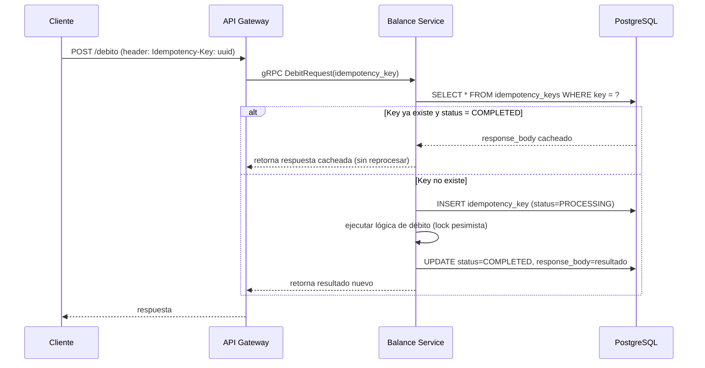
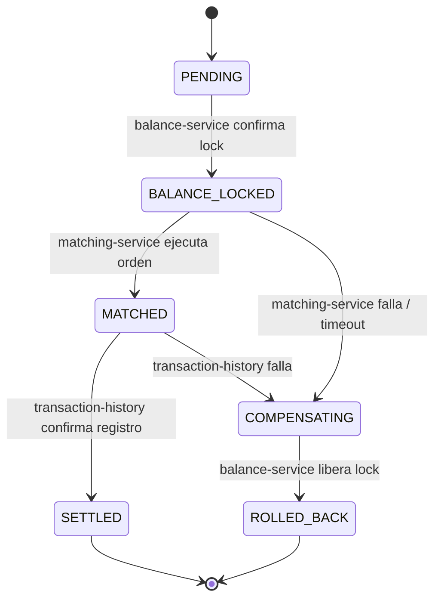
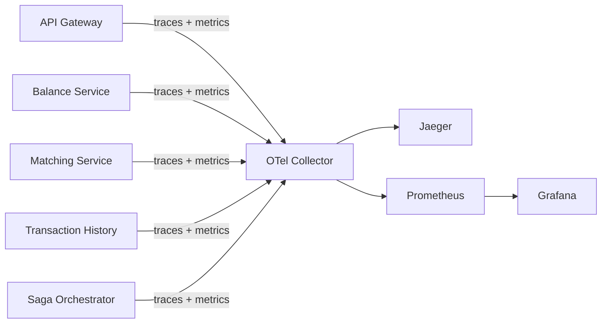
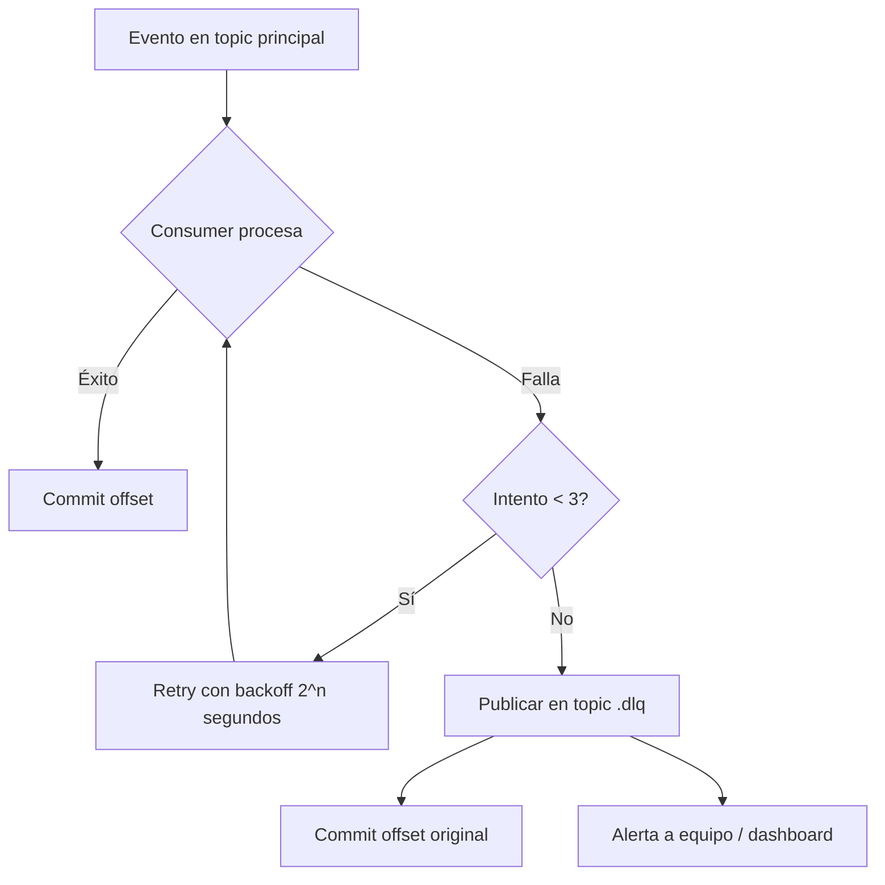
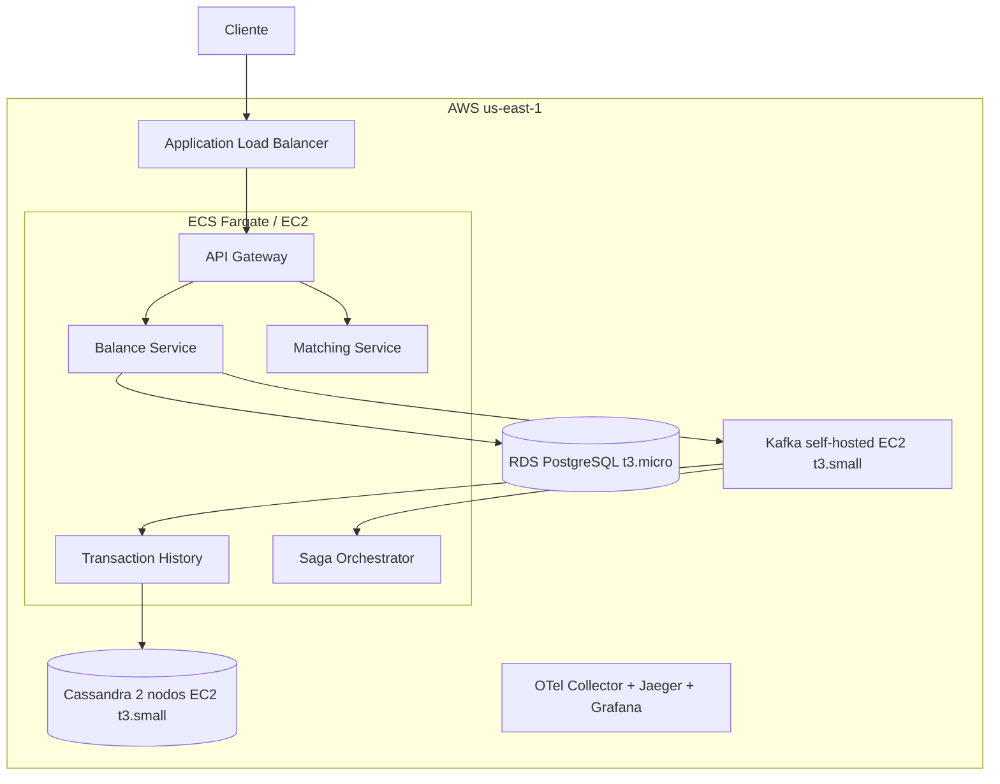

# Plan de Implementación Técnico — NexusChain

**Proyecto:** Plataforma de procesamiento de transacciones financieras en tiempo real
**Integrantes:** Paima La Torre Jorge Enrique · Pachas Oshiro Kojiro Andre · Cardenas Cacha Aldair Raul · Del Solar Rojas Jorge Sebastián · Navarro Laguna Sergio Edgardo
**Documento:** Plan técnico de mejoras sobre la propuesta base
**Versión:** 1.0

---

## 1. Resumen ejecutivo

NexusChain, en su estado actual, implementa correctamente los pilares académicos de un sistema distribuido: Teorema CAP, patrón Saga, consenso Raft, sharding, IPC síncrono/asíncrono. Este documento detalla las mejoras necesarias para llevar el proyecto de "prueba de concepto que demuestra conceptos de curso" a "arquitectura defendible como sistema financiero real", identificando específicamente los módulos nuevos a construir, su diseño técnico, y el plan de despliegue en AWS.

El criterio rector de este plan es: **cada mejora debe ser justificable ante la pregunta "¿por qué esto y no otra cosa?"** — priorizando lo que un jurado de sustentación de sistemas distribuidos preguntaría primero.

---

## 2. Arquitectura actual: resumen de lo ya construido

| Componente | Tecnología | Responsabilidad | Estado |
|---|---|---|---|
| API Gateway | Node/TS + Express | Auth JWT, TLS, rate limiting, proxy gRPC | ✅ Completo |
| Balance Service | Java + PostgreSQL (Supabase) | Débitos/créditos, ACID, locks pesimistas | ✅ Completo |
| Matching Service | Go | Motor de emparejamiento de órdenes, stateless | ✅ Completo |
| Bus de eventos | Kafka | Comunicación asíncrona, particionado por asset/usuario | ✅ Completo |
| Transaction History | Node + Cassandra | Registro inmutable, consistencia eventual | ✅ Completo |
| Consensus Service | Go (simulación Raft, 3 nodos) | Elección de líder, coherencia de configuración | ✅ Completo (simulado) |
| CI/CD | GitHub Actions | Test automatizado, build de contenedores | ✅ Completo |

**Diagnóstico honesto para la sustentación:** el sistema resuelve bien el "camino feliz" (happy path). Las brechas están en el manejo de fallos parciales, que es precisamente el tema central de un curso de sistemas distribuidos — así que cerrarlas fortalece la nota, no solo el producto.

---

## 3. Gaps identificados y justificación técnica

### 3.1 Ausencia de idempotencia
**Problema:** si un cliente reintenta una request de débito (por timeout de red, doble clic, etc.), el sistema actual no tiene forma de detectar que es un duplicado. Esto viola directamente el objetivo declarado de "prevenir el doble gasto" — la propuesta previene doble gasto por *inconsistencia de datos* (vía locks ACID) pero no por *duplicación de requests*, que es un vector distinto y muy común en sistemas de pago reales.

### 3.2 Saga sin compensación explícita
**Problema:** la propuesta dice "Implementar el Patrón Saga para asegurar la atomicidad resiliente", pero el flujo descrito (bloquear balance → publicar evento → consumir → emparejar → registrar) no define qué ocurre si el paso de matching falla *después* de que el balance ya fue bloqueado. Un Saga sin pasos de compensación no es un Saga — es solo un pipeline asíncrono con esperanza de que todo funcione.

### 3.3 Relojes lógicos declarados pero no implementados
**Problema:** la propuesta menciona "Relojes de Lamport o Vectoriales" pero la implementación real usa "IDs de eventos ordenados secuencialmente". Un ID secuencial (ej. autoincremental o timestamp) **no captura causalidad distribuida** — no puede distinguir entre "evento A ocurrió antes que B" y "A y B son concurrentes y no relacionados". Esto es una brecha conceptual que un profesor de sistemas distribuidos detectará de inmediato.

### 3.4 Sin observabilidad distribuida
**Problema:** con comunicación síncrona (gRPC) y asíncrona (Kafka) mezcladas en flujos Saga, depurar "¿dónde se perdió esta transacción?" sin tracing distribuido es prácticamente imposible en producción.

### 3.5 Sin manejo de eventos fallidos (DLQ)
**Problema:** si el consumidor de Kafka en Matching o Transaction History falla al procesar un evento (excepción, timeout, dato corrupto), el comportamiento por defecto de Kafka es reintentar indefinidamente o perder el mensaje, según configuración — ninguno de los dos es aceptable en un sistema financiero.

### 3.6 Seguridad interna incompleta
**Problema:** TLS está descrito para cliente↔servicios, pero no hay mención de autenticación servicio↔servicio (mTLS). Cualquier proceso dentro de la red interna podría, en teoría, invocar al Balance Service directamente sin pasar por el Gateway.

---

## 4. Diseño técnico de módulos nuevos

### 4.1 Idempotency Layer

**Ubicación:** Balance Service (Java), a nivel de interceptor antes de la lógica de negocio.

**Esquema de base de datos (PostgreSQL):**

```sql
CREATE TABLE idempotency_keys (
    idempotency_key   UUID PRIMARY KEY,
    request_hash      VARCHAR(64) NOT NULL,      -- SHA-256 del payload, detecta reuso indebido de la misma key
    response_status   INT,
    response_body     JSONB,
    status            VARCHAR(20) NOT NULL DEFAULT 'PROCESSING', -- PROCESSING | COMPLETED | FAILED
    created_at        TIMESTAMPTZ NOT NULL DEFAULT now(),
    expires_at        TIMESTAMPTZ NOT NULL DEFAULT (now() + interval '24 hours')
);

CREATE INDEX idx_idempotency_expires ON idempotency_keys(expires_at);
```

**Flujo:**



**Detalles de implementación:**
- El cliente genera el `Idempotency-Key` (UUID v4) en el frontend por cada intento de transacción, no por cada request HTTP (así el retry automático de Axios reutiliza la misma key).
- Un job de limpieza (cron o scheduled task en Spring) borra keys con `expires_at < now()` cada hora.
- Si la misma key llega con un `request_hash` distinto, se rechaza con `409 Conflict` — evita que un cliente reutilice una key para una operación diferente.

---

### 4.2 Saga Orchestrator explícito

**Decisión de diseño:** pasar de coreografía implícita (servicios reaccionando a eventos de Kafka sin coordinación central) a un **orquestador explícito**, más fácil de auditar y depurar para el alcance de este proyecto.

**Nuevo servicio:** `saga-orchestrator` (Node.js + TypeScript, liviano, stateless salvo por su tabla de estado).

**Máquina de estados:**



**Esquema de base de datos:**

```sql
CREATE TABLE saga_instances (
    saga_id         UUID PRIMARY KEY,
    transaction_id  UUID NOT NULL,
    current_state   VARCHAR(30) NOT NULL,
    payload         JSONB NOT NULL,
    created_at      TIMESTAMPTZ NOT NULL DEFAULT now(),
    updated_at      TIMESTAMPTZ NOT NULL DEFAULT now(),
    retry_count     INT NOT NULL DEFAULT 0
);

CREATE TABLE saga_steps_log (
    id              SERIAL PRIMARY KEY,
    saga_id         UUID REFERENCES saga_instances(saga_id),
    step_name       VARCHAR(50) NOT NULL,
    status          VARCHAR(20) NOT NULL, -- SUCCESS | FAILED | COMPENSATED
    detail          JSONB,
    timestamp       TIMESTAMPTZ NOT NULL DEFAULT now()
);
```

**Lógica de compensación (pseudocódigo del orquestador):**

```typescript
async function handleSagaEvent(event: SagaEvent) {
  const saga = await getSagaInstance(event.sagaId);

  switch (event.type) {
    case 'MATCHING_FAILED':
      await logStep(saga.sagaId, 'matching', 'FAILED', event.detail);
      await transitionTo(saga.sagaId, 'COMPENSATING');
      await publishCommand('balance-service', {
        command: 'RELEASE_LOCK',
        transactionId: saga.transactionId,
      });
      break;

    case 'BALANCE_RELEASED':
      await logStep(saga.sagaId, 'compensation', 'SUCCESS', event.detail);
      await transitionTo(saga.sagaId, 'ROLLED_BACK');
      await notifyClient(saga.transactionId, 'TRANSACTION_REVERSED');
      break;

    // ... resto de transiciones
  }
}
```

**Justificación de la decisión (para la sustentación):** un orquestador centralizado sacrifica algo de desacoplamiento (los servicios ahora conocen al orquestador) a cambio de trazabilidad y facilidad de debugging — un trade-off razonable para un sistema donde la auditoría es un requisito de negocio (regulación financiera), no solo un "nice to have" técnico.

---

### 4.3 Observabilidad distribuida

**Stack:** OpenTelemetry (SDK en cada microservicio) → OpenTelemetry Collector → Jaeger (tracing) + Prometheus/Grafana (métricas).

**Arquitectura de despliegue:**



**Correlación de trazas:** cada request al Gateway genera un `trace_id` (W3C Trace Context estándar) que se propaga vía headers gRPC/HTTP y se adjunta como parte del payload de eventos Kafka, permitiendo reconstruir el camino completo de una transacción — desde que el cliente hace click hasta que se registra en Cassandra — en una sola vista de Jaeger.

**Métricas clave a exponer (Prometheus):**

| Métrica | Tipo | Servicio |
|---|---|---|
| `balance_debit_latency_seconds` | Histogram | Balance Service |
| `saga_state_transitions_total` | Counter (con label `state`) | Saga Orchestrator |
| `kafka_consumer_lag` | Gauge | Todos los consumidores |
| `matching_order_book_depth` | Gauge | Matching Service |
| `raft_leader_elections_total` | Counter | Consensus Service |

Este último es particularmente valioso para la demo en vivo: pueden matar el nodo líder de Raft y mostrar en Grafana, en tiempo real, cómo sube el contador de elecciones y cuánto tarda el nuevo líder en asumir.

---

### 4.4 Dead Letter Queue (DLQ)

**Diseño:** cada consumidor de Kafka (Matching Service, Transaction History) implementa un patrón de reintento con backoff exponencial (máx. 3 intentos), y tras agotarlos, publica el evento fallido en un topic dedicado.



**Configuración de topics:**

```yaml
topics:
  - name: nexuschain.balance.events
    partitions: 6
    replication-factor: 3
  - name: nexuschain.balance.events.dlq
    partitions: 3
    replication-factor: 3
    retention.ms: 604800000  # 7 días, tiempo para investigar manualmente
```

---

### 4.5 mTLS entre microservicios

**Alcance:** todas las comunicaciones gRPC internas (Gateway↔Balance, Balance↔Saga Orchestrator, etc.) requieren certificados mutuos.

**Implementación mínima viable para el proyecto:**
- CA interna autofirmada (con `openssl` o `cfssl`), generada una vez y distribuida como secretos en Kubernetes/Docker Compose.
- Cada servicio presenta su certificado de cliente al conectar; el servidor valida contra la CA interna.
- Rotación de certificados: fuera de alcance para el proyecto académico, mencionar como trabajo futuro.

---

### 4.6 Ledger de doble entrada (mejora opcional, alto valor para la sustentación)

**Justificación:** un balance simple (`saldo = saldo - monto`) no es cómo funcionan los sistemas financieros reales. El estándar de la industria es contabilidad de doble entrada: cada transacción genera al menos dos asientos (débito en una cuenta, crédito en otra) que deben sumar cero.

**Esquema:**

```sql
CREATE TABLE ledger_entries (
    entry_id        UUID PRIMARY KEY,
    transaction_id  UUID NOT NULL,
    account_id      UUID NOT NULL,
    entry_type      VARCHAR(6) NOT NULL CHECK (entry_type IN ('DEBIT', 'CREDIT')),
    amount          NUMERIC(18,2) NOT NULL CHECK (amount > 0),
    currency        VARCHAR(3) NOT NULL DEFAULT 'PEN',
    created_at      TIMESTAMPTZ NOT NULL DEFAULT now()
);

-- Invariante de negocio: para cada transaction_id, SUM(debit) = SUM(credit)
```

Mencionar esto en la sustentación —aunque no se implemente completo— demuestra que el equipo entiende la diferencia entre "un balance que funciona" y "un balance auditable", que es exactamente lo que un banco exige.

---

## 5. Infraestructura AWS

### 5.1 Escenario A — Demo / sustentación (recomendado para el proyecto)



**Decisiones de costo clave:**
- **Evitar EKS**: el control plane de EKS cobra $0.10/hora (~$73/mes) *antes* de correr un solo contenedor. Para 5 microservicios pequeños en un proyecto académico, ECS Fargate (sin cargo de control plane) o incluso EC2 simple con Docker Compose es más barato y más rápido de configurar.
- **Evitar MSK (Kafka administrado)**: el clúster mínimo de MSK Provisioned requiere 3 brokers y arranca en aproximadamente $460/mes solo en cómputo de brokers, sin contar almacenamiento. Kafka auto-hospedado en 1-2 instancias EC2 t3.small cuesta una fracción de eso y es perfectamente suficiente para el volumen de una demo.
- **Cassandra auto-hospedada** en 2 nodos pequeños en lugar de Amazon Keyspaces gestionado, para mantener el control total sobre la configuración de replicación que exige la sustentación (multi-master).

| Recurso | Configuración | Costo estimado/mes |
|---|---|---|
| ECS Fargate (5 servicios pequeños) | 0.25-0.5 vCPU c/u | $40-70 |
| RDS PostgreSQL | db.t3.micro, single-AZ | $15-25 |
| Kafka en EC2 | 1x t3.small | $15 |
| Cassandra en EC2 | 2x t3.small | $30 |
| ALB | 1 balanceador | $18-20 |
| OTel/Jaeger/Grafana en EC2 | 1x t3.small | $15 |
| **Total estimado** | | **$130-175/mes** |

Gran parte de esto es cubierto por AWS Free Tier durante el primer año si usan una cuenta nueva del equipo (o de la universidad, si tienen créditos educativos — vale la pena que revisen si UNMSM tiene convenio con AWS Educate).

### 5.2 Escenario B — Producción real (referencia, no para desplegar)

| Recurso | Configuración | Costo estimado/mes |
|---|---|---|
| EKS multi-AZ | Control plane + nodos redundantes | $400-700 |
| MSK Provisioned | 3+ brokers, multi-AZ | $500-700 |
| RDS Multi-AZ + réplicas | db.r6g.large o similar | $300-500 |
| Cassandra multi-región | Keyspaces o self-hosted 6+ nodos | $400-600 |
| Seguridad (WAF, Secrets Manager, GuardDuty) | | $100-200 |
| Observabilidad gestionada (Datadog/New Relic) | | $200-400 |
| **Total estimado** | | **$1,900-3,100/mes** |

Sin contar auditorías de seguridad externas, certificación PCI-DSS, ni personal de SRE — que en un banco real son costos operativos, no de infraestructura.

---

## 6. Cronograma de trabajo (4-6 semanas, 5 integrantes)

| Semana | Entregable | Responsable sugerido |
|---|---|---|
| 1 | Idempotency Layer + esquema de BD | 1 persona (Balance Service ya en Java) |
| 1-2 | Saga Orchestrator (máquina de estados + compensación) | 2 personas |
| 2 | DLQ en Kafka + reintentos con backoff | 1 persona |
| 2-3 | Observabilidad (OTel + Jaeger + Grafana) | 1 persona |
| 3 | mTLS entre servicios | 1 persona (en paralelo con frontend) |
| 3-4 | Despliegue en AWS (escenario A) | 2 personas |
| 4-5 | Testing de integración + simulación de partición de red (demo CAP en vivo) | Todo el equipo |
| 5-6 | Documentación final + ensayo de sustentación | Todo el equipo |

---

## 7. Riesgos y mitigaciones

| Riesgo | Probabilidad | Mitigación |
|---|---|---|
| Tiempo insuficiente para implementar todo | Alta | Priorizar Idempotencia + Saga Orchestrator + Observabilidad — son los 3 puntos que más preguntas generan en sustentación |
| Costos de AWS superan el presupuesto del equipo | Media | Usar Free Tier, apagar recursos fuera de horario de pruebas, usar Docker Compose local para desarrollo y solo desplegar a AWS para la demo final |
| Complejidad de mTLS retrasa el cronograma | Media | Es la mejora de menor prioridad — se puede dejar como "trabajo futuro" documentado sin implementar si el tiempo aprieta |
| Simulación de partición de red falla en vivo durante sustentación | Media | Grabar un video de respaldo de la demo funcionando, además de intentarla en vivo |

---

## 8. Checklist priorizado de mejoras

- [ ] **Alta prioridad** — Idempotency Layer en Balance Service
- [ ] **Alta prioridad** — Saga Orchestrator con compensación explícita
- [ ] **Alta prioridad** — Observabilidad (tracing + métricas)
- [ ] **Alta prioridad** — DLQ para eventos fallidos de Kafka
- [ ] **Media prioridad** — mTLS entre microservicios
- [ ] **Media prioridad** — Ledger de doble entrada (o al menos documentarlo como diseño)
- [ ] **Baja prioridad para el proyecto, alta para producción real** — Rate limiting distribuido con Redis, sharding real de Cassandra multi-región, certificación de cumplimiento normativo
